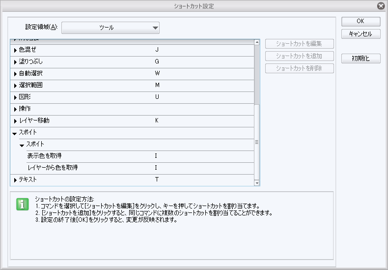

# ショートカット登録

以下キーボードのショートカットなのでiPadの場合これらの機能を用いるなら別途キーボードを買う必要がある

## ツール

`メニューバーのファイル→ショートカット設定→設定領域 ツール`　で変更可能

キーバインドは単一しか出来ないっぽい?

同じキーの登録は出来る。

例えばスポイトのショートカット割り当てはデフォルトでIだが、それを詳細に

表示色を取得、レイヤーから色を取得にIを割り当てると[fig.1]

1回目のIで表示色を取得(またはレイヤーから色を取得)、

2回目のIでレイヤーから色を取得(または表示色を取得)になる

[fig.1]

なのでサブツールで２つ以上使ったりするのがあるのは個別で登録しておくと便利

例: 消しゴム.軟らかめと消しゴム.硬めをEに登録するなど
